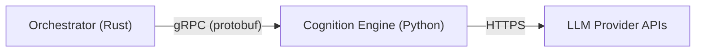

# Cognition Engine — Work Scope

> Python component responsible for prompt formatting, token counting, structured data parsing, and fallback handling. Lives in `cognition_engine/`.

---

## 1. Work Items

### 1.1 LLM Client Layer (`llm_client.py`)
Wrap **LiteLLM** to provide a single async interface for chat completions.

| Sub-task | Detail |
|---|---|
| Install & configure LiteLLM | `litellm` package; model routing config (env-based) |
| Retry / rate-limit policy | Leverage LiteLLM's built-in retry + rate-limit callbacks |
| Streaming support | Expose an async generator for streamed responses |
| Fallback chain | Primary → fallback model ordering (e.g. `gpt-4o` → `claude-3.5-sonnet`) |
| Error mapping | Map provider errors to a unified `CognitionError` hierarchy |

---

### 1.2 Prompt Formatter (`prompt_formatter.py`)
Assemble system / user / assistant messages into the final prompt payload.

| Sub-task | Detail |
|---|---|
| Template registry | Load Jinja2 (or string-based) prompt templates from `templates/` |
| Variable injection | Accept a dict of context vars, render into the template |
| Role tagging | Build the `messages` list with correct `role` fields |
| Prompt-size guard | Pre-check assembled prompt against token budget before sending |

---

### 1.3 Token Counter (`token_counter.py`)
Use **tiktoken** to predict prompt sizes and enforce limits.

| Sub-task | Detail |
|---|---|
| Encoding loader | Cache the correct tiktoken encoding for the target model |
| Count functions | `count_tokens(text) → int`, `count_messages(messages) → int` |
| Truncation helper | Truncate or summarize context to fit a given budget |
| Budget calculator | Given model max context, compute remaining tokens for completion |

---

### 1.4 Structured Output Parser (`output_parser.py`)
Parse LLM responses into validated structured data.

| Sub-task | Detail |
|---|---|
| JSON extraction | Extract JSON from markdown code fences or raw text |
| Schema validation | Validate extracted JSON against Pydantic models |
| Repair heuristics | Fix common LLM JSON errors (trailing commas, unquoted keys) |
| Fallback to re-prompt | If parsing fails after repair, re-prompt the LLM with the error |

---

### 1.5 Fallback & Error Handling (`fallback.py`)
Unified resilience layer across the engine.

| Sub-task | Detail |
|---|---|
| Retry decorator | Configurable retries with exponential backoff |
| Model fallback | Switch to a cheaper/different model on repeated failures |
| Graceful degradation | Return a structured error response instead of crashing |
| Logging & metrics | Structured logging; counters for retries, fallbacks, parse failures |

---

### 1.6 gRPC Service Interface (`service.py` + `cognition.proto`)
Expose the engine to the Orchestrator over gRPC.

| Sub-task | Detail |
|---|---|
| Proto definition | `CognitionService` with RPCs: `Complete`, `StreamComplete`, `CountTokens`, `ParseOutput` |
| Server bootstrap | `grpc.aio` server with reflection and health check |
| Request / response mapping | Translate protobuf messages ↔ internal Python types |
| Auth / metadata | Read session ID and access-control metadata from gRPC headers |

---

### 1.7 Configuration & Project Scaffold

| Sub-task | Detail |
|---|---|
| `cognition_engine/` directory | Package init, `__main__.py` entry point |
| `pyproject.toml` | Dependencies: `litellm`, `tiktoken`, `grpcio`, `grpcio-tools`, `pydantic`, `jinja2` |
| Settings | Pydantic `BaseSettings` class loading from env / `.env` |
| Logging setup | `structlog` or stdlib logging with JSON output |
| Dockerfile | Multi-stage build for the gRPC server |

---

## 2. Interfaces With Other Components

**Inbound (from Orchestrator):**
- `Complete(prompt, model, params) → response`
- `StreamComplete(prompt, model, params) → stream of chunks`
- `CountTokens(text, model) → token_count`

**Outbound:**
- HTTPS calls to LLM providers (via LiteLLM)

---

## 3. Suggested Build Order

| Phase | Deliverable | Depends on |
|---|---|---|
| **P0** | Project scaffold + config + token counter | — |
| **P1** | LLM client with retry/fallback | P0 |
| **P2** | Prompt formatter + templates | P0 |
| **P3** | Structured output parser | P1 |
| **P4** | gRPC service wiring | P1, P2, P3 |
| **P5** | Dockerfile + integration tests | P4 |

---

## 4. Key Risks & Open Questions

| # | Decision | Resolution |
|---|---|---|
| 1 | **Model selection** | Primary: **Gemini 2.5 Flash** (fast). Fallback: **Gemini 2.0 Flash**. tiktoken encoding scoped to these models accordingly. |
| 2 | **Streaming granularity** | Structured output parsing operates on **complete responses only** (structured payloads are assumed short). |
| 3 | **Proto ownership** | `.proto` files live in a **shared `proto/` directory** at the repo root, imported by both Orchestrator and Cognition Engine. |
| 4 | **Auth passthrough** | Session ID and auth context carried as a **field in every request message** (explicit, schema-validated, log-friendly). |
| 5 | **Embedding support** | **Out of scope** for the Cognition Engine. Embedding generation lives in the Memory component (Qdrant handles vectorization). |
