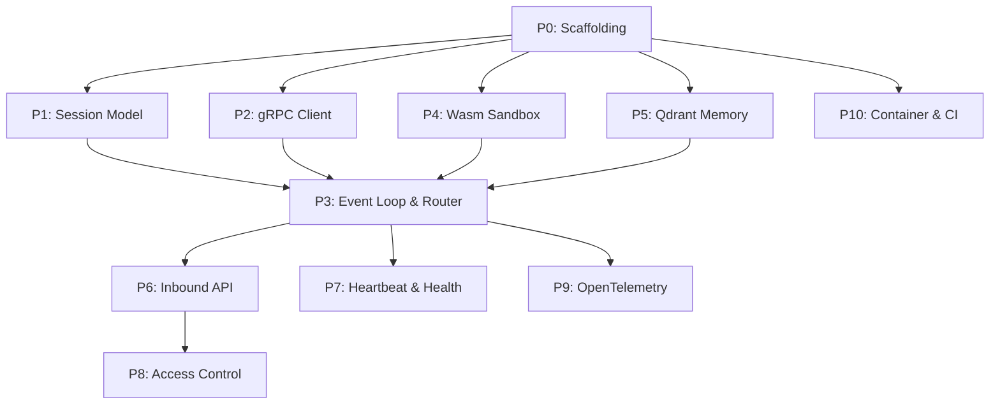

# Orchestrator (TypeScript) – Work Scope

## Overview

The Orchestrator is the **core daemon** of the AI Agent system. This is the **TypeScript / Node.js** implementation, a port of the existing Rust orchestrator. It is the central hub that connects all other components:

| Connection | Protocol | Notes |
|---|---|---|
| Orchestrator ↔ Cognition Engine | gRPC (protobuf) | [cognition.proto](file:///Users/xizhao/projects/ai_agent/proto/cognition.proto) already defined with 4 RPCs |
| Orchestrator ↔ Tool Sandbox | In-process (WASI host functions) | Via Node WASI / `wasmtime` bindings |
| Orchestrator ↔ Memory/Storage | HTTP/gRPC client | Qdrant vector DB |
| Messaging Adapters → Orchestrator | WebSockets or Webhooks | Inbound user messages |

**Responsibilities**: Event loop management, heartbeat scheduling, routing, and access control.
**Key design constraint**: Supports multiple concurrent sessions, each processed serially (single in-flight turn per session via an async mutex), each with separate agent memory.

> **Runtime target**: Node.js 20+ LTS, ESM, TypeScript `strict` mode. Node's single-threaded event loop replaces Rust's Tokio runtime; CPU-bound isolation (Wasm) runs on worker threads where needed.

---

## Prioritized Work Breakdown

### P0 — Project Scaffolding
> **Estimated effort**: Small
> **Dependencies**: None

- [x] Initialize Node project (`npm init`) in `/orchestrator-ts`, ESM (`"type": "module"`)
- [x] Set up `package.json` + `tsconfig.json` (strict, `NodeNext` module resolution) with initial dependencies:
  - `@grpc/grpc-js` + `@grpc/proto-loader` + `ts-proto` — gRPC client/server + protobuf codegen
  - `fastify` + `@fastify/websocket` — HTTP/WebSocket server
  - `zod` (runtime validation / structured parsing)
  - `uuid` (session IDs)
  - `pino` (structured logging)
- [x] Dev tooling: `tsx` (dev runner), `vitest` (tests), `typescript-eslint`, `prettier`, `tsup`/`tsc` (build)
- [x] Codegen script at `scripts/gen-proto.sh` (runs `protoc` + `ts-proto` plugin; requires `protoc` installed)
- [x] Verify bare project type-checks (`tsc --noEmit` passes)

---

### P1 — Session Model & State Management
> **Estimated effort**: Medium
> **Dependencies**: P0

- [ ] Define `Session` type:
  - `sessionId: string` (UUID)
  - `createdAt: number` (epoch ms)
  - `lastActive: number`
  - `conversationHistory: Message[]` (mirrors proto `Message`)
  - `state: SessionState` union (`'idle' | 'processing' | 'awaitingTool' | 'error'`)
- [ ] Define `SessionStore` (in-memory session registry):
  - `Map<string, Session>` with a per-session async lock (`async-mutex` or a small home-grown mutex)
  - Methods: `create()`, `get()`, `remove()`, `listActive()`, `cleanupExpired()`
- [ ] Ensure single-turn-at-a-time guarantee per session (per-session async mutex achieves this; Node's event loop gives no parallelism but interleaving must be guarded)
- [ ] Unit tests for session lifecycle (vitest)

---

### P2 — Cognition Engine gRPC Client
> **Estimated effort**: Medium
> **Dependencies**: P0

- [ ] Generate TS client from `proto/cognition.proto` (`ts-proto` / `nice-grpc`)
- [ ] Create `CognitionClient` wrapper class with:
  - Connection management (channel creation, reconnect, keepalive)
  - `complete()` → calls `Complete` RPC
  - `streamComplete()` → calls `StreamComplete` RPC (returns async iterable)
  - `countTokens()` → calls `CountTokens` RPC
  - `parseOutput()` → calls `ParseOutput` RPC
- [ ] Populate `RequestContext` (session_id, auth_token) on every call (gRPC metadata)
- [ ] Add retry logic with exponential backoff for transient gRPC failures
- [ ] Config: Cognition Engine address, timeouts, retry params (env vars, prefix `ORCH_`)
- [ ] Integration test: connect to running Cognition Engine, call `CountTokens`

---

### P3 — Core Event Loop & Request Router
> **Estimated effort**: Large
> **Dependencies**: P1, P2

- [ ] Define `AgentRequest` and `AgentResponse` types for internal message routing
- [ ] Implement the main agent loop (`runTurn`):
  1. Receive user message (via inbound handler from adapter layer — P6)
  2. Look up or create session
  3. Count tokens → trim history if needed
  4. Call `Complete` / `StreamComplete` on Cognition Engine
  5. Parse response → detect if tool invocation is requested
  6. If tool call → dispatch to Tool Sandbox (P4) → feed result back → loop
  7. Return final response to adapter
- [ ] Implement routing table / dispatcher pattern for extensibility
- [ ] Handle error paths: Cognition Engine unavailable, parse failures, tool errors
- [ ] Add configurable max-loop-iterations guard (prevent infinite tool loops)

---

### P4 — Tool Execution Sandbox Integration (WASI)
> **Estimated effort**: Large
> **Dependencies**: P0

- [ ] Choose a Wasm runtime: Node's built-in `node:wasi` (experimental) or `@bytecodealliance/jco` / a `wasmtime` Node binding; run instances on `worker_threads` for isolation + cancellation
- [ ] Define host function interface (the functions Wasm modules can call):
  - File I/O (sandboxed via WASI preopens)
  - Network requests (opt-in, permission-scoped)
  - Return structured results
- [ ] Implement `ToolExecutor` class:
  - Load `.wasm` modules on startup
  - `execute(toolName, argsJson) → Promise<string>` (throws `ToolError`)
  - Execution timeout enforcement (worker termination)
  - Resource limits (memory + instruction/fuel cap where the runtime supports it)
- [ ] **Tool format**: each tool is a `tool.md` file (TOML frontmatter + Markdown description)
- [ ] Scan `tools/` directory at startup; parse only frontmatter to build the registry (no Wasm loaded yet)
- [ ] **Lazy loading**: compile `.wasm` on first invocation; cache the compiled `WebAssembly.Module`
- [ ] Fresh instance/worker per invocation for isolation; reuse cached compiled module for speed
- [ ] Permission scopes declared in `tool.md` frontmatter, enforced by host function layer / WASI preopen config
- [ ] Unit tests with a minimal test `.wasm` module (compiled inline from WAT via `wabt`)

---

### P5 — Memory & Qdrant Integration
> **Estimated effort**: Medium
> **Dependencies**: P0

- [ ] Add `@qdrant/js-client-rest` dependency
- [ ] Implement `MemoryStore` class:
  - Client to Qdrant (HTTP/gRPC, connection reuse)
  - `store(sessionId, text, payload)` — embed and store arbitrary text
  - `search(sessionId, query, topK) → Promise<unknown[]>` — semantic search
  - `storeConversation(sessionId, messages)` — upsert full conversation snapshot (deterministic IDs, idempotent)
  - `getConversation(sessionId) → Promise<Message[]>` — scroll + sort by seq
  - `healthCheck()` — ping Qdrant for heartbeat use
- [ ] Embeddings in-process via `fastembed-js` or `@xenova/transformers` running **BAAI/bge-small-en-v1.5** (384-dim, ONNX) — no network hop, no extra service
- [ ] `EmbeddingEngine` singleton loaded once at startup; exposes `embed(text)` and `embedBatch(texts)`
- [ ] Per-session collection/namespace isolation in Qdrant (collection named `{prefix}_{sessionId}`)
- [ ] Connection health checks and reconnect logic (fail-open at startup with warning; health exposed via heartbeat)
- [ ] `MemoryStore` wired into entry point, router, WS state, and webhook state
- [ ] Conversation persisted to Qdrant after every agent turn (errors logged, never propagated)
- [ ] Integration test against a running Qdrant instance (skipped by default unless `QDRANT_URL` set)

---

### P6 — Inbound API Layer (WebSocket / Webhook)
> **Estimated effort**: Medium
> **Dependencies**: P3

- [ ] Use `fastify` (with `@fastify/websocket`) or `express` + `ws` for HTTP/WebSocket server
- [ ] WebSocket endpoint: `/ws` — persistent bidirectional connection per user
  - On connect → create or resume session
  - On message → enqueue `AgentRequest` into event loop
  - On response → push `AgentResponse` back through socket
- [ ] Webhook endpoint: `POST /webhook` — stateless request/response
  - Authenticate (HMAC signature or token)
  - Map to session, run agent loop, return response
- [ ] User authentication middleware (token validation)
- [ ] Rate limiting per user/session

---

### P7 — Heartbeat & Health
> **Estimated effort**: Small
> **Dependencies**: P1, P2, P5

- [ ] Background timer: periodic heartbeat to check:
  - Cognition Engine connectivity (gRPC health check — it already exposes `grpc.health.v1`)
  - Qdrant health
  - Session cleanup (remove expired/idle sessions)
- [ ] Expose health endpoint: `GET /health` returning JSON status of each subsystem
- [ ] gRPC health service on the Orchestrator itself (for upstream monitoring)

---

### P8 — Access Control
> **Estimated effort**: Small–Medium
> **Dependencies**: P6

- [ ] Define `AccessPolicy` model:
  - Which tools a session/user can invoke
  - Which models can be requested (pass through to Cognition Engine)
  - Rate limits per user
- [ ] Middleware to restrict routes/actions by policy
- [ ] Populate `RequestContext.auth_token` from validated user credentials

---

### P9 — OpenTelemetry Instrumentation
> **Estimated effort**: Small
> **Dependencies**: P3

- [ ] Configure `@opentelemetry/sdk-node` with OTLP exporter (`@opentelemetry/exporter-trace-otlp-grpc`)
- [ ] Instrument key spans:
  - Full request lifecycle (`session_id`, `user_id` as span attributes)
  - Cognition Engine RPC calls (timing, status)
  - Tool execution (tool name, duration, success/failure)
  - Memory queries
- [ ] Auto-instrumentation for HTTP/gRPC via `@opentelemetry/auto-instrumentations-node`
- [ ] Config: OTLP endpoint, service name, sampling rate (env vars)

---

### P10 — Containerization & CI
> **Estimated effort**: Small
> **Dependencies**: P0+

- [ ] Multi-stage `Dockerfile` (builder with `npm ci` + `tsc` → slim `node:20-slim` runtime)
- [ ] `.dockerignore`
- [ ] `docker-compose.yml` update to run Orchestrator-ts alongside Cognition Engine + Qdrant
- [ ] CI workflow: `eslint`, `tsc --noEmit`, `vitest run`, `npm run build`

---

## Suggested Implementation Order



**Critical path**: P0 → P2 → P3 → P6 (minimum for end-to-end user message → LLM response)

**Parallelizable after P0**: P1, P2, P4, P5 can all be developed independently.

---

## Key npm Dependencies

| Package | Purpose | Rust analog |
|---|---|---|
| `@grpc/grpc-js` | gRPC framework (client + server) | `tonic` |
| `ts-proto` / `@grpc/proto-loader` | Protobuf codegen / loading | `prost` |
| `fastify` + `@fastify/websocket` | HTTP/WebSocket server | `axum` |
| `node:wasi` / `@bytecodealliance/jco` | Wasm execution + WASI sandbox | `wasmtime` |
| `@qdrant/js-client-rest` | Qdrant vector DB | `qdrant-client` |
| `fastembed-js` / `@xenova/transformers` | BGE embeddings in-process (ONNX) | `fastembed` |
| `@opentelemetry/sdk-node` | Observability | `tracing-opentelemetry` |
| `zod` | Runtime validation / parsing | `serde` (+ validation) |
| `@iarna/toml` / `smol-toml` | `tool.md` frontmatter parsing | `toml` |
| `uuid` | Session IDs | `uuid` |
| `pino` | Structured logging | `tracing` |

## Design Decisions

### 1. Runtime — Node.js event loop

Node's single-threaded async runtime replaces Tokio. There is no real parallelism for JS code, so per-session serialization uses an **async mutex** rather than an OS thread lock — it guards against interleaved `await` points within a session. CPU-bound or untrusted work (Wasm tool execution) is offloaded to `worker_threads` so the main loop stays responsive and tools can be force-terminated on timeout. Distributed / multi-node sessions are explicitly out of scope.

### 2. Embedding Model — BGE in-process

Use `fastembed-js` (or `@xenova/transformers`) with `BAAI/bge-small-en-v1.5` (384-dim, ONNX). Runs entirely in the Orchestrator process — no network hop, no extra service. Upgrade path to `bge-base-en-v1.5` (768-dim) if retrieval quality needs improvement.

### 3. Tool Format — `tool.md` (TOML frontmatter + Markdown)

Identical to the Rust orchestrator so tool definitions are shared. Each tool lives as a self-describing file in a `tools/` directory:

```toml
---
name = "read_file"
version = "1.0.0"
description = "Read the contents of a local file."
wasm = "tools/read_file.wasm"
timeout_secs = 10

[permissions]
fs_read = true
fs_write = false
network = false

[[args]]
name = "path"
type = "string"
required = true
description = "Absolute path of the file to read."

[[args]]
name = "max_bytes"
type = "integer"
required = false
default = 4096
description = "Max bytes to read."
---

# read_file

Reads a file from the local filesystem up to `max_bytes` bytes...
```

**Lazy loading**: at startup only the TOML frontmatter is parsed to build the in-memory registry. The `.wasm` binary is compiled and cached on first invocation. Each call gets a fresh instance/worker for isolation.

### 4. Tool-Call Protocol — JSON-in-Fence

Identical wire protocol to the Rust orchestrator. The LLM signals a tool call by emitting a `tool_call` fenced block. The Orchestrator detects it with a regex pass after each completion.

**LLM output (tool request):**
````
Some reasoning...

```tool_call
{
  "tool": "read_file",
  "call_id": "c1",
  "args": { "path": "/workspace/notes.txt" }
}
```
````

**Orchestrator injects back (tool result, as next message):**
````
```tool_result
{
  "call_id": "c1",
  "status": "ok",
  "output": "Hello from notes.txt"
}
```
````

**Agent loop with tool calls:**
```
user message
  ├─ count tokens, trim history if needed
  ├─ Complete / StreamComplete → LLM response
  │    ├─ contains ```tool_call```?
  │    │    ├─ YES → execute → inject tool_result → loop (max 10 iterations)
  │    │    └─ NO  → final response → adapter
  └─ error? → abort with structured error message
```

Available tool names + arg schemas (from registry) are injected into the system prompt at session start.

### 5. Parity with the Rust Orchestrator

This service is a behavioral port: same gRPC contract (`proto/cognition.proto`), same `tool.md` format, same tool-call wire protocol, same env-var configuration surface (`ORCH_*`), and the same WebSocket/webhook endpoints. The two implementations are interchangeable behind the messaging adapters, allowing side-by-side comparison and gradual migration.
