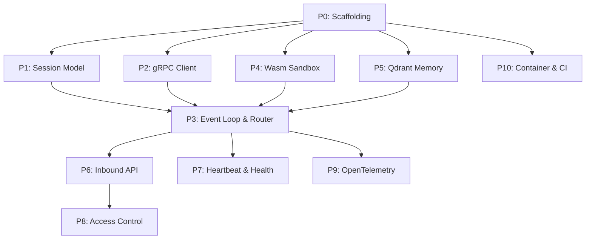

# Orchestrator – Work Scope

## Overview

The Orchestrator is the **core daemon** of the AI Agent system, written in **Rust**. It is the central hub that connects all other components:

| Connection | Protocol | Notes |
|---|---|---|
| Orchestrator ↔ Cognition Engine | gRPC (protobuf) | [cognition.proto](file:///Users/xizhao/projects/ai_agent/proto/cognition.proto) already defined with 4 RPCs |
| Orchestrator ↔ Tool Sandbox | In-process (Wasm host functions) | Via Wasmtime |
| Orchestrator ↔ Memory/Storage | Direct TCP (connection pooling) | Qdrant vector DB |
| Messaging Adapters → Orchestrator | WebSockets or Webhooks | Inbound user messages |

**Responsibilities**: Event loop management, heartbeat scheduling, routing, and access control.  
**Key design constraint**: Supports multiple concurrent sessions, each pinned to one thread at a time, each with separate agent memory.

---

## Prioritized Work Breakdown

### P0 — Project Scaffolding
> **Estimated effort**: Small  
> **Dependencies**: None

- [ ] Initialize Rust project (`cargo init --name orchestrator`) in `/orchestrator`
- [ ] Set up `Cargo.toml` with initial dependencies:
  - `tonic` + `prost` (gRPC client/server + protobuf codegen)
  - `tokio` (async runtime)
  - `tracing` + `tracing-subscriber` + `tracing-opentelemetry` (OpenTelemetry instrumentation)
  - `serde` / `serde_json` (serialization)
  - `uuid` (session IDs)
  - `thiserror` / `anyhow` (error handling)
- [ ] Set up `build.rs` for `tonic-build` to compile `proto/cognition.proto`
- [ ] Verify bare project compiles and proto codegen works

---

### P1 — Session Model & State Management
> **Estimated effort**: Medium  
> **Dependencies**: P0

- [x] Define `Session` struct:
  - `session_id: String` (UUID)
  - `created_at: Instant`
  - `last_active: Instant`
  - `conversation_history: Vec<Message>` (mirrors proto `Message`)
  - `state: SessionState` enum (`Idle`, `Processing`, `AwaitingTool`, `Error`)
- [x] Define `SessionStore` (thread-safe session registry):
  - `HashMap<String, Arc<Mutex<Session>>>` behind `Arc<RwLock<…>>`
  - Methods: `create()`, `get()`, `remove()`, `list_active()`, `cleanup_expired()`
- [x] Ensure single-thread-at-a-time guarantee per session (the `Mutex<Session>` lock achieves this)
- [x] Unit tests for session lifecycle

---

### P2 — Cognition Engine gRPC Client
> **Estimated effort**: Medium  
> **Dependencies**: P0

- [x] Generate Rust client from `proto/cognition.proto` via `tonic-build`
- [x] Create `CognitionClient` wrapper struct with:
  - Connection management (channel creation, reconnect)
  - `complete()` → calls `Complete` RPC
  - `stream_complete()` → calls `StreamComplete` RPC (returns `tonic::Streaming`)
  - `count_tokens()` → calls `CountTokens` RPC
  - `parse_output()` → calls `ParseOutput` RPC
- [x] Populate `RequestContext` (session_id, auth_token) on every call
- [x] Add retry logic with exponential backoff for transient gRPC failures
- [x] Config: Cognition Engine address, timeouts, retry params (env vars, prefix `ORCH_`)
- [x] Integration test: connect to running Cognition Engine, call `CountTokens`

---

### P3 — Core Event Loop & Request Router
> **Estimated effort**: Large  
> **Dependencies**: P1, P2

- [x] Define `AgentRequest` and `AgentResponse` enums for internal message routing
- [x] Implement the main agent loop:
  1. Receive user message (via inbound channel from adapter layer — P6)
  2. Look up or create session
  3. Count tokens → trim history if needed
  4. Call `Complete` / `StreamComplete` on Cognition Engine
  5. Parse response → detect if tool invocation is requested
  6. If tool call → dispatch to Tool Sandbox (P4) → feed result back → loop
  7. Return final response to adapter
- [x] Implement routing table / dispatcher pattern for extensibility
- [x] Handle error paths: Cognition Engine unavailable, parse failures, tool errors
- [x] Add configurable max-loop-iterations guard (prevent infinite tool loops)

---

### P4 — Tool Execution Sandbox Integration (Wasmtime)
> **Estimated effort**: Large  
> **Dependencies**: P0

- [x] Add `wasmtime` dependency
- [x] Define host function interface (the functions Wasm modules can call):
  - File I/O (sandboxed via WASI)
  - Network requests (opt-in, permission-scoped)
  - Return structured results
- [x] Implement `ToolExecutor` struct:
  - Load `.wasm` modules on startup
  - `execute(tool_name, args_json) → Result<String, ToolError>`
  - Execution timeout enforcement
  - Resource limits (memory pages + fuel/instruction cap)
- [x] **Tool format**: each tool is a `tool.md` file (TOML frontmatter + Markdown description)
- [x] Scan `tools/` directory at startup; parse only frontmatter to build the registry (no Wasm loaded yet)
- [x] **Lazy loading**: compile + instantiate `.wasm` on first invocation; cache the compiled `Module`
- [x] Fresh `Store` per invocation for isolation; reuse cached `Module` for speed
- [x] Permission scopes declared in `tool.md` frontmatter, enforced by host function layer
- [x] Unit tests with a minimal test `.wasm` module (compiled inline from WAT)

---

### P5 — Memory & Qdrant Integration
> **Estimated effort**: Medium  
> **Dependencies**: P0

- [x] Add `qdrant-client` Rust crate dependency
- [x] Implement `MemoryStore` struct:
  - Connection pool to Qdrant (TCP)
  - `store(session_id, text, payload)` — embed and store arbitrary text
  - `search(session_id, query, top_k) → Vec<Value>` — semantic search
  - `store_conversation(session_id, messages)` — upsert full conversation snapshot (deterministic IDs, idempotent)
  - `get_conversation(session_id) → Vec<Message>` — scroll + sort by seq
  - `health_check()` — ping Qdrant for heartbeat use
- [x] Add `fastembed-rs` crate — runs **BAAI/bge-small-en-v1.5** in-process via ONNX (no network hop, no extra service)
- [x] `EmbeddingEngine` singleton loaded once at startup; exposes `embed(text) → Vec<f32>` and `embed_batch(texts) → Vec<Vec<f32>>`
- [x] Per-session collection/namespace isolation in Qdrant (collection named `{prefix}_{session_id}`)
- [x] Connection health checks and reconnect logic (fail-open at startup with warning; health exposed via heartbeat)
- [x] `MemoryStore` wired into `main.rs`, router, `WsState`, and `WebhookState` (`Option<Arc<MemoryStore>>`)
- [x] Conversation persisted to Qdrant after every agent turn via `agent_loop::run_turn` (errors logged, never propagated)
- [x] Integration test against a running Qdrant instance (`tests/memory_integration.rs`, 4 `#[ignore]`d tests)

---

### P6 — Inbound API Layer (WebSocket / Webhook)
> **Estimated effort**: Medium  
> **Dependencies**: P3

- [ ] Add `axum` or `warp` for HTTP/WebSocket server
- [ ] WebSocket endpoint: `/ws` — persistent bidirectional connection per user
  - On connect → create or resume session
  - On message → enqueue `AgentRequest` into event loop
  - On response → push `AgentResponse` back through socket
- [ ] Webhook endpoint: `POST /webhook` — stateless request/response
  - Authenticate (HMAC signature or token)
  - Map to session, run agent loop, return response
- [ ] User authentication middleware (token validation)
- [ ] Rate limiting per user/session

---

### P7 — Heartbeat & Health
> **Estimated effort**: Small  
> **Dependencies**: P1, P2, P5

- [ ] Background task: periodic heartbeat to check:
  - Cognition Engine connectivity (gRPC health check — it already exposes `grpc.health.v1`)
  - Qdrant health
  - Session cleanup (remove expired/idle sessions)
- [ ] Expose health endpoint: `GET /health` returning JSON status of each subsystem
- [ ] gRPC health service on the Orchestrator itself (for upstream monitoring)

---

### P8 — Access Control
> **Estimated effort**: Small–Medium  
> **Dependencies**: P6

- [ ] Define `AccessPolicy` model:
  - Which tools a session/user can invoke
  - Which models can be requested (pass through to Cognition Engine)
  - Rate limits per user
- [ ] Middleware to restrict routes/actions by policy
- [ ] Populate `RequestContext.auth_token` from validated user credentials

---

### P9 — OpenTelemetry Instrumentation
> **Estimated effort**: Small  
> **Dependencies**: P3

- [ ] Configure `tracing-opentelemetry` with OTLP exporter
- [ ] Instrument key spans:
  - Full request lifecycle (`session_id`, `user_id` as span attributes)
  - Cognition Engine RPC calls (timing, status)
  - Tool execution (tool name, duration, success/failure)
  - Memory queries
- [ ] Expose metrics endpoint or push to collector
- [ ] Config: OTLP endpoint, service name, sampling rate (env vars)

---

### P10 — Containerization & CI
> **Estimated effort**: Small  
> **Dependencies**: P0+

- [ ] Multi-stage `Dockerfile` (builder with cargo + protoc → slim runtime)
- [ ] `.dockerignore`
- [ ] `docker-compose.yml` update to run Orchestrator alongside Cognition Engine + Qdrant
- [ ] CI workflow: `cargo clippy`, `cargo test`, `cargo build --release`

---

## Suggested Implementation Order



**Critical path**: P0 → P2 → P3 → P6 (minimum for end-to-end user message → LLM response)

**Parallelizable after P0**: P1, P2, P4, P5 can all be developed independently.

---

## Key Rust Crate Dependencies

| Crate | Purpose |
|---|---|
| `tonic` | gRPC framework (client + server) |
| `prost` | Protobuf codegen |
| `tokio` | Async runtime |
| `axum` | HTTP/WebSocket server |
| `wasmtime` | Wasm execution + WASI sandbox |
| `qdrant-client` | Qdrant vector DB |
| `fastembed` | BGE embeddings in-process (ONNX) |
| `tracing` / `tracing-opentelemetry` | Observability |
| `serde` / `serde_json` | Serialization |
| `toml` | `tool.md` frontmatter parsing |
| `uuid` | Session IDs |
| `thiserror` | Error types |

## Design Decisions

### 1. Embedding Model — BGE in-process

Use **`fastembed-rs`** with `BAAI/bge-small-en-v1.5` (384-dim, 33M params, ONNX). Runs entirely in the Orchestrator process — no network hop, no extra service. Upgrade path to `bge-base-en-v1.5` (768-dim) if retrieval quality needs improvement.

### 2. Tool Format — `tool.md` (TOML frontmatter + Markdown)

Each tool lives as a self-describing file in a `tools/` directory:

```toml
---
name = "read_file"
version = "1.0.0"
description = "Read the contents of a local file."
wasm = "tools/read_file.wasm"
timeout_secs = 10

[permissions]
fs_read = true
fs_write = false
network = false

[[args]]
name = "path"
type = "string"
required = true
description = "Absolute path of the file to read."

[[args]]
name = "max_bytes"
type = "integer"
required = false
default = 4096
description = "Max bytes to read."
---

# read_file

Reads a file from the local filesystem up to `max_bytes` bytes...
```

**Lazy loading**: at startup only the TOML frontmatter is parsed to build the in-memory registry. The `.wasm` binary is compiled and cached on first invocation. Each call gets a fresh `Store` for isolation.

### 3. Tool-Call Protocol — JSON-in-Fence

The LLM signals a tool call by emitting a `tool_call` fenced block. The Orchestrator detects it with a regex pass after each completion.

**LLM output (tool request):**
````
Some reasoning...

```tool_call
{
  "tool": "read_file",
  "call_id": "c1",
  "args": { "path": "/workspace/notes.txt" }
}
```
````

**Orchestrator injects back (tool result, as next message):**
````
```tool_result
{
  "call_id": "c1",
  "status": "ok",
  "output": "Hello from notes.txt"
}
```
````

**Agent loop with tool calls:**
```
user message
  ├─ count tokens, trim history if needed
  ├─ Complete / StreamComplete → LLM response
  │    ├─ contains ```tool_call```?
  │    │    ├─ YES → execute → inject tool_result → loop (max 10 iterations)
  │    │    └─ NO  → final response → adapter
  └─ error? → abort with structured error message
```

Available tool names + arg schemas (from registry) are injected into the system prompt at session start.

### 4. Scaling — Single-binary, multi-threaded

Tokio async runtime; one process. Each session is protected by `Mutex<Session>` so only one task works on it at a time. Distributed / multi-node sessions are explicitly out of scope.

